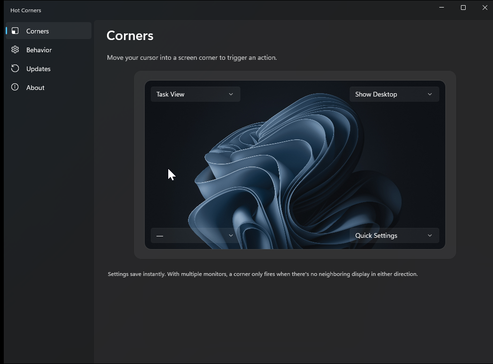
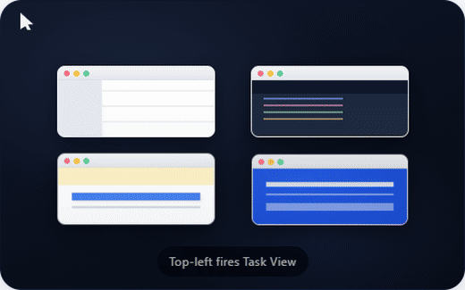

# Hot Corners for Windows

  

macOS-style **Hot Corners** for Windows. Move your cursor into any corner of your screen, hold it for a moment, and your favorite action fires. Open Task View, Show Desktop, switch virtual desktops, lock your PC, and more.

 

  
  
  
  
  
  
  

  

---

## Install

1. Go to the [latest release](https://github.com/bwya77/Windows-Hot-Corners/releases/latest).
2. Download the installer for your PC:
   * **HotCornersSetup-x.y.z-win-x64.exe** for most Windows PCs.
   * **HotCornersSetup-x.y.z-win-arm64.exe** for ARM laptops like the Surface Pro X or Copilot+ PCs with Snapdragon chips.
3. Double-click the installer and follow the prompts.

That's it. Hot Corners installs into Program Files, adds itself to **Start with Windows**, and shows up in your system tray. There's no .NET runtime to install. SmartScreen will not warn you because every release is code-signed.

When a new version is out, Hot Corners notifies you in the tray and updates itself in place.

### Uninstall

Open **Settings**, then **Apps**, find **Hot Corners**, and click **Uninstall**. Your preferences are kept so you don't lose your corner setup if you reinstall later.

---

## Use it

After install, look for the Hot Corners icon in your system tray (bottom-right of the screen, near the clock; you may need to click the small "show hidden icons" arrow first).

* **Double-click** the tray icon to open the settings window.
* **Right-click** the tray icon for a quick menu (Settings, Pause, Check for updates, About, Exit).

The settings window shows a screen-shaped preview with a dropdown for each of the four corners. Pick what you want each corner to do. Changes save instantly.

**Default setup:** the top-left corner opens Task View, the same way it does on a Mac.

### What each corner can do

| Action | What happens |
|---|---|
| Task View | Opens the Windows task switcher (also closes it if it's already open) |
| Show Desktop | Minimizes everything so you can see your desktop |
| Quick Settings | Opens the Wi-Fi, volume, and brightness flyout |
| Notification Center | Opens your notifications and calendar |
| Start Menu | Opens the Start menu |
| Search | Opens Windows Search |
| Widgets | Opens the Widgets panel |
| Lock Screen | Locks your PC |
| Previous Desktop | Switches one virtual desktop to the left |
| Next Desktop | Switches one virtual desktop to the right |
| Snap Window Left | Snaps the active window to the left half of the screen |
| Snap Window Right | Snaps the active window to the right half of the screen |
| Minimize All | Minimizes every open window |
| Put Display to Sleep | Turns the display off (handy on a laptop) |

### Settings you can tweak

* **Dwell time:** how long you have to hold the cursor in a corner before it fires. The default of 25 milliseconds feels nearly instant. Raise it if you keep firing corners by accident, lower it for the snappiest possible response.
* **Corner overlay:** a soft, translucent puddle blooms into the corner as you hold the cursor there, then gently fades out when the action fires. It adapts to your Windows theme (light puddle on dark wallpapers, dark puddle on light ones) and clicks pass right through it. On by default.
* **Monitors:** choose whether all of your displays have hot corners, or only your primary monitor.
* **Suppress in full-screen apps:** skip firing while a real full-screen app such as a game or a full-screen video is in the foreground, so you don't accidentally open Task View mid-match.
* **Start with Windows:** Hot Corners launches automatically when you sign in. On by default.
* **Pause:** turn the corners off temporarily without quitting the app. Handy when you're doing fine work near a corner.

---

## How corner detection works (in plain English)

A corner only fires when your cursor actually bumps into the screen on **both** axes, meaning there's nowhere else for it to go. If you have a second monitor sitting to the right of your main one, the cursor can slide off the right edge onto that monitor, so the right corners of the main monitor are inert. The same rule that macOS uses, so it feels natural.

---

## Privacy and trust

* Hot Corners runs entirely on your PC. It does not collect telemetry, analytics, or any personal data.
* The only network call it makes is a periodic check to **api.github.com** to see whether a new release is available.
* Every release is signed with **Azure Trusted Signing** under the publisher identity *Bradley Wyatt*, so Windows can verify it came from a known author and hasn't been tampered with.
* Every release also publishes a SLSA build provenance attestation through GitHub. If you're security-conscious you can verify it yourself with the GitHub CLI (see [SIGNING.md](SIGNING.md)).
* The full source code is in this repository under the [MIT license](LICENSE).

---

## License

[MIT](LICENSE) © 2026 Bradley Wyatt
